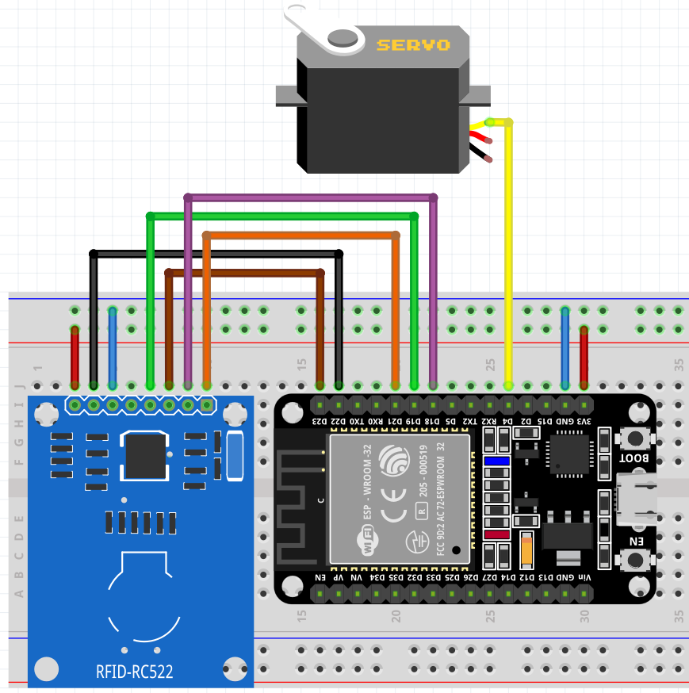

## ESP32智能门禁系统
支持`刷校园卡`、`网页按钮控制`驱动舵机完成开锁动作<br>

## 硬件清单


|`````材料 `````|
| ------ |
| ESP32 WROOM 32 |
| MG995舵机(180°) |
| RFID-RC522 |
| 热熔胶 |
| 鱼线 |
<br>

本项目代码简单, 关键在于通过合适的方法让舵机拉开门锁:<br>
由于一般舵机拉力太小, 所以使用拉力较大的55g MG995金属标准舵机<br>
由于一般的线强度不够, 所以使用鱼线<br>

## 效果图:


## 硬件接线：

